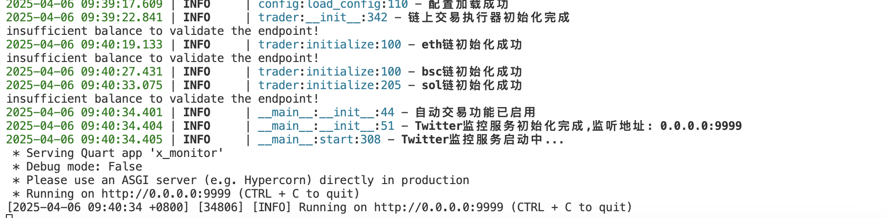
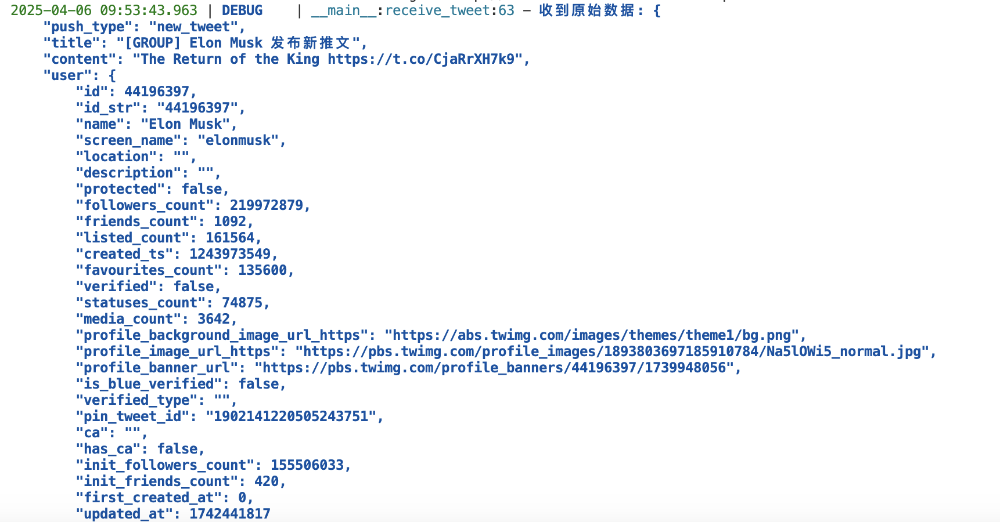
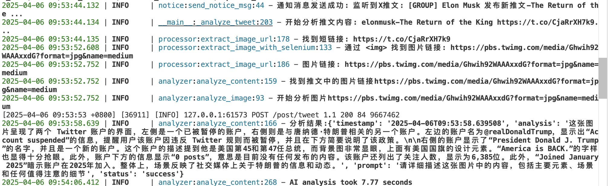
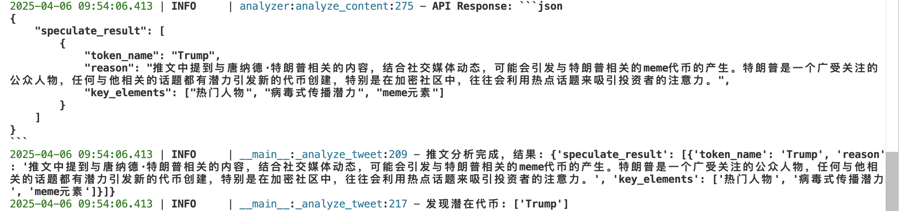
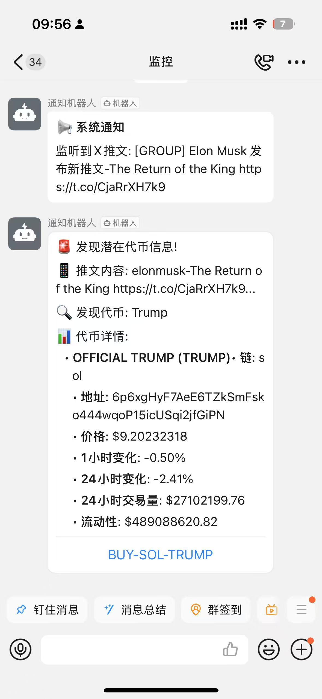

# X-monitor Project Introduction

## Overview
X-monitor is a real-time monitoring system based on Twitter (X) that automatically analyzes tweet content using large language models, identifies potential MEME cryptocurrency trading opportunities, and supports automated on-chain transactions.

## Key Features
1. **Tweet Monitoring**: Receives Twitter tweet data via API
2. **AI Analysis**: Uses large language models to analyze tweet content and identify potential token information
3. **Token Search**: Automatically searches for token market data (price, liquidity, etc.)
4. **Transaction Execution**: Supports automated token transactions on Ethereum/BSC/Solana chains
5. **Notification System**: Sends real-time notifications via DingTalk robot

## Project Structure
X-monitor/
├── abi/                    # Smart Contract ABIs
│   ├── erc20.json          
│   └── router.json         
├── monitor/                # Monitoring Modules
│   ├── telegram_monitor.py # Telegram Monitoring
│   └── webhook_monitor.py  # Webhook Listener
├── notify/                 # Notification Modules
│   ├── dingding.py         # DingTalk Bot
│   └── telegram_bot.py     # Telegram Bot
├── analyzer.py             # AI Analysis Module
├── config.py               # Configuration Management
├── data_def.py             # Data Structure Definitions
├── notice.py               # Notification System Core
├── processor.py            # Tweet Content Processor
├── trader.py               # On-chain Trading Module
├── x_monitor.py            # Main Service Entry
├── .env                    # Environment Variables
└── requirements.txt        # Dependencies

## Quick Start
1. Install dependencies
We recommend using conda for environment management. After installing conda, create a Python 3.10 environment named xmonitor and activate it:
```bash
conda create --name xmonitor python=3.10
conda activate xmonitor
```

```bash
pip install -r requirements.txt
playwright install chromium
``

2.Configure environment variables: Copy .env.example to .env and fill in your configuration:
- LLM_API_KEY: OpenAI-compatible API key (model needs to support image analysis)
- DINGTALK_TOKEN/SECRET: DingTalk robot credentials
- Blockchain related configurations (private keys, RPCs, etc.)

3. Subscribe to X push service: This project uses apidance's push service. Reference: https://alpha.apidance.pro/welcome When subscribing, select custom Hook push address to your server. Example: http://188.1.1.99:9999/post/tweet

4. Start the service:
```bash
python main.py
```

5. Testing 
POST /post/tweet
```
{
    "push_type": "new_tweet",
    "title": "[GROUP] Elon Musk's new tweet",
    "content": "The Return of the King https://t.co/CjaRrXH7k9",
    "user": {
        "id": 44196397,
        "id_str": "44196397",
        "name": "Elon Musk",
        "screen_name": "elonmusk",
        "location": "",
        "description": "",
        "protected": false,
        "followers_count": 219972879,
        "friends_count": 1092,
        "listed_count": 161564,
        "created_ts": 1243973549,
        "favourites_count": 135600,
        "verified": false,
        "statuses_count": 74875,
        "media_count": 3642,
        "profile_background_image_url_https": "https://abs.twimg.com/images/themes/theme1/bg.png",
        "profile_image_url_https": "https://pbs.twimg.com/profile_images/1893803697185910784/Na5lOWi5_normal.jpg",
        "profile_banner_url": "https://pbs.twimg.com/profile_banners/44196397/1739948056",
        "is_blue_verified": false,
        "verified_type": "",
        "pin_tweet_id": "1902141220505243751",
        "ca": "",
        "has_ca": false,
        "init_followers_count": 155506033,
        "init_friends_count": 420,
        "first_created_at": 0,
        "updated_at": 1742441817
    },
    "tweet": {
        "id": 60393895,
        "tweet_id": "1902564961307488532",
        "user_id": "44196397",
        "media_type": "photo",
        "text": "https://t.co/zBa4F6YApG",
        "medias": [
            "https://pbs.twimg.com/ext_tw_video_thumb/1902520094779179008/pu/img/GAxFkN4qowT1vGA_.jpg"
        ],
        "urls": null,
        "is_self_send": true,
        "is_retweet": false,
        "is_quote": false,
        "is_reply": false,
        "is_like": false,
        "related_tweet_id": "",
        "related_user_id": "",
        "publish_time": 1742441809,
        "has_deleted": false,
        "last_deleted_check_at": 0,
        "ca": "",
        "has_ca": false,
        "created_at": 1742441821,
        "updated_at": 1742441821
    }
}
```

## Demo
 



