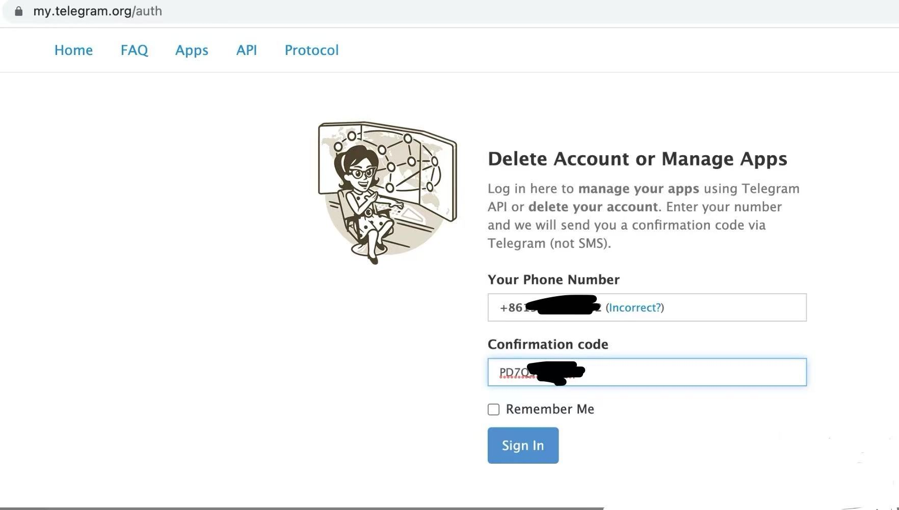
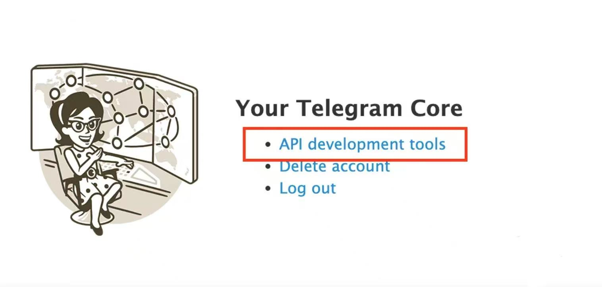
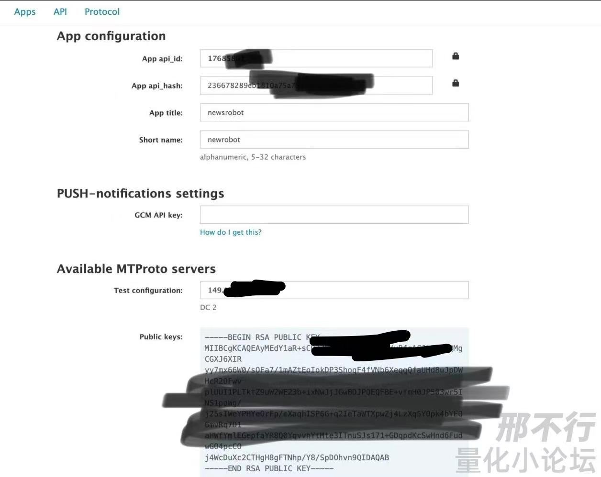

# Telegram 驱动模式环境配置
## 注册telegram bot机器人
在telegram中搜索找到[BotFather](https://t.me/BotFather),使用/newbot 命令创建新Bot.创建成功根据步骤填入bot名称等信息，完成bot创建。创建成功后会得到Bot API Token. 
## 创建接收消息Chanel /Group
需要创建两个Chanel, 一个用于接收Kbot推送的消息(TELEGRAM_NEWS_PUSH),一个用于我们项目的消息推送(TELEGRAM_NOTIFY).
创建好Chanel后,在Chanel中手工发送消息,并将消息转发到官方的[GetIDs Bot](https://t.me/getidsbot), 得到Chanel的Chat ID.

## telegram Chanel监听开发者账号申请
tg提供了很好的开发接口，要使用sdk,需要api hash，你也可以简单的认为，就是你个人的开发者账号token。
获取地址为 https://my.telegram.org/apps

弄完之后，就拿到了自己的api_id,api_hash. app_tile这些随便填，关键是这个api_hash，调用api授权就靠这个。

## Kbot配置
[Kbot官网](https://www.kbot.club/)连接自己的web3钱包. 选择推特监控,配置好自己的telegram bot token和telegram chanel id(TELEGRAM_NEWS_PUSH).
按照[推特监控](https://docs.kbot.club/gong-neng/jian-kong-yu-jing/tui-te-jian-kong)说明文档,配置好自己想监听的X 账号信息.
